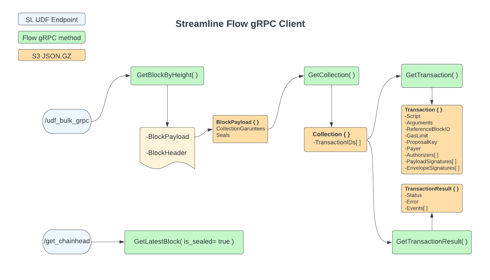
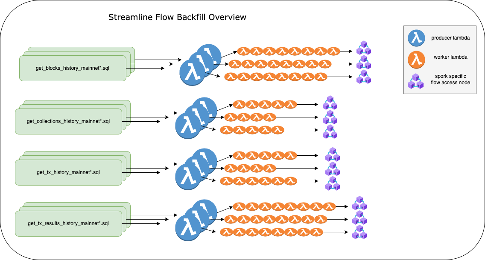

# Streamline history backfill overview

The `streamline-flow` udf's are designed to allow ingesting from a specific Flow Access Node using the [gRPC Flow Access API](https://developers.flow.com/concepts/nodes/access-api). The `/udf_bulk_grpc` endpoint is designed to allow backfilling historical data from a Flow Access Node and takes in udf params based on the Flow event type you need to ingest. 

```json
# example collection udf params
{
    "grpc": "proto3",
    "method": "get_collection",
    "block_height": 457896215,
    "method_params": {"id": 457896215 }
}
```

The `method` attribute is the gRPC method you want to call on the Flow Access Node. The `method_params` attribute is a json object that contains the params for the gRPC method you are calling. The `block_height` attribute is the block height of the collection you want to backfill from. To specify the [Flow Spork](https://developers.flow.com/concepts/nodes/node-operation/past-sporks) specific [node_url](./core/history/blocks/streamline__get_blocks_history_mainnet22.sql#L3) you need to specify the [block height range](./core/history/blocks/streamline__get_blocks_history_mainnet22.sql#L31) in the `WHERE` clause of the `get_history*.sql` you want to backfill from.

## Snowflake External Tables

We deserialize the raw protobuf responses from the gRPC calls into `json.gz` files and load them into Snowflake External Tables. 



## Backfill Throughput tuning

Since each Flow Spork has a different block height range and isolated `Access Node`, we can attenuate the throughput of the backfill for each `mainnet spork` and `event type` seperately by adjusting the `sql_limit`, `concurrent_requests`, `producer_batch_size` and `worker_batch_size` udf params passed in through the `if_data_call_function` dbt model `post_hook`. 

See [here](https://github.com/FlipsideCrypto/streamline-flow/discussions/10) for more details on how to tune the backfill throughput. `TLDR` you can adjust the number of concurrent gRPC requests, the number of worker lambdas and the number of rows per worker to tune the throughput of the backfill per `spork mainnet` `Flow Access Node`.  

